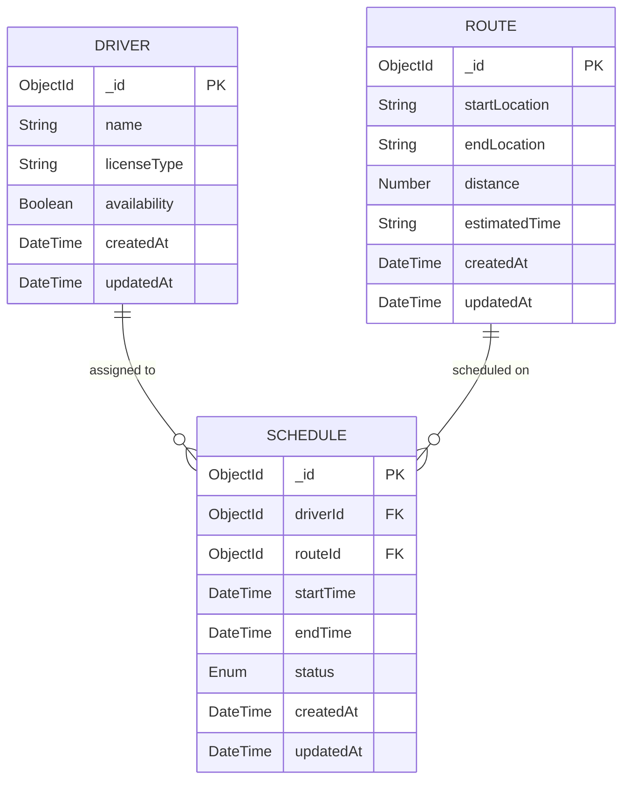

# 🚛 Route Management System

> A modern RESTful API for intelligent transportation management with automated driver assignment and real-time schedule tracking.

[](https://nodejs.org/)
[](https://www.mongodb.com/)
[](https://expressjs.com/)

## 🌟 Features

### 🎯 Core Functionality
- **Smart Driver Management** - Add drivers with license validation and real-time availability tracking
- **Intelligent Route Planning** - Create routes with automatic optimal driver assignment
- **Dynamic Schedule System** - Real-time tracking of active, completed, and unassigned schedules
- **Historical Analytics** - Comprehensive driver performance history with pagination support
- **Auto-Completion Engine** - Cron-based automatic schedule completion and driver availability restoration

### 🔧 Technical Features
- **Data Validation** - Robust request validation using Joi schemas
- **Error Handling** - Comprehensive error management with detailed responses
- **Pagination Support** - Efficient data retrieval for large datasets
- **RESTful Architecture** - Clean, intuitive API design following REST principles

---

## 🗄️ Database Architecture



### 🔗 Relationships
- **Driver** ↔ **Schedule**: `One-to-Many` (A driver can handle multiple routes over time)
- **Route** ↔ **Schedule**: `One-to-Many` (A route can be scheduled multiple times)
- **Schedule Status**: `active` | `completed` | `unassigned`

---

## 📡 API Endpoints

| Method | Endpoint | Description | Features |
|--------|----------|-------------|----------|
| `POST` | `/api/drivers` | Add new driver | ✅ Validation, 🔒 License verification |
| `GET` | `/api/drivers/:id/history` | Driver route history | 📄 Pagination, 🔍 Status filtering |
| `POST` | `/api/routes` | Create new route | 🤖 Auto-assignment, ⚡ Instant scheduling |
| `GET` | `/api/schedules` | List all schedules | 📄 Pagination, 🔗 Population |

---

## 🚀 Quick Start

### 📋 Prerequisites
- **Node.js** `v18.0.0+`
- **MongoDB** `v4.4+` running on `localhost:27017`
- **npm** or **yarn** package manager

### ⚡ Installation

1. **Clone & Navigate**
   ```bash
   git clone <repository-url>
   cd route-management-system
   ```

2. **Install Dependencies**
   ```bash
   npm install
   ```

3. **Environment Setup**
   ```bash
   # Create .env file
   touch .env
   ```
   
   Add the following configuration:
   ```env
   SERVER_PORT=3000
   DB_CONNECTION=mongodb://127.0.0.1:27017/routeSystem
   ```
   
   > 🔒 **Security Note**: The `.env` file is automatically excluded from version control via `.gitignore`

4. **Launch Application**
   ```bash
   npm start
   ```

🎉 **Server running at** `http://localhost:3000`

---

## 🧠 System Logic & Assumptions

### 📊 Data Structure Design
- **Driver Profiles**: Name, license type, and real-time availability status
- **Route Definitions**: Start/end locations, distance metrics, and flexible time estimation
- **Schedule Management**: Comprehensive linking system with automated status tracking

### 🤖 Business Intelligence
- **Smart Assignment**: First-available driver gets automatically assigned to new routes
- **Availability Management**: Drivers become unavailable during active routes
- **Auto-Completion**: System automatically completes expired schedules
- **Fallback Handling**: Routes without available drivers are marked as "unassigned"

### 💡 System Behavior
- **Time Format Flexibility**: Supports natural language like `"2 hours 30 mins"`, `"45 mins"`, `"1 hour"`
- **Pagination Defaults**: 4 items per page with customizable limits
- **Background Processing**: Cron job runs every minute for schedule maintenance
- **Resilient Architecture**: Database connectivity is validated before critical operations

### 🛡️ Error Handling Strategy
- **404 Management**: Graceful handling of non-existent resources
- **Validation Feedback**: Detailed, field-specific error messages
- **Connection Resilience**: Comprehensive database failure logging
- **Process Stability**: Cron job failures are isolated and logged without system crashes

### 🔐 Security Considerations
- **Environment Protection**: `.env` file excluded from git repository
- **Production Readiness**: Environment variables designed for secure deployment
- **Database Security**: Production configurations should include authentication
- **Sensitive Data**: No hardcoded credentials or sensitive information

---

<div align="center">

**🌟 Built with modern Node.js practices for scalable transportation management**

*For support or contributions, please refer to the project documentation*

</div>
